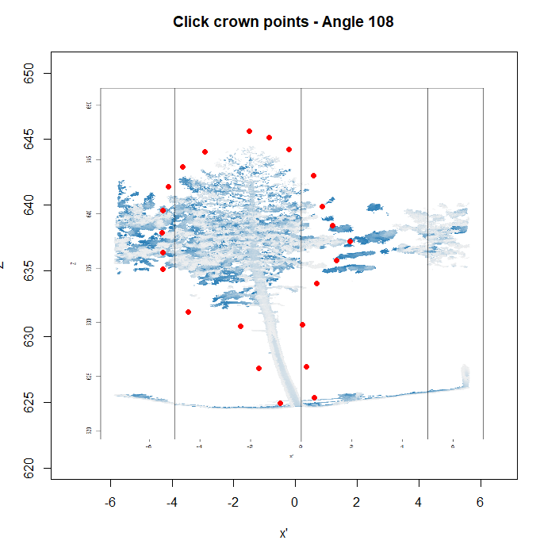
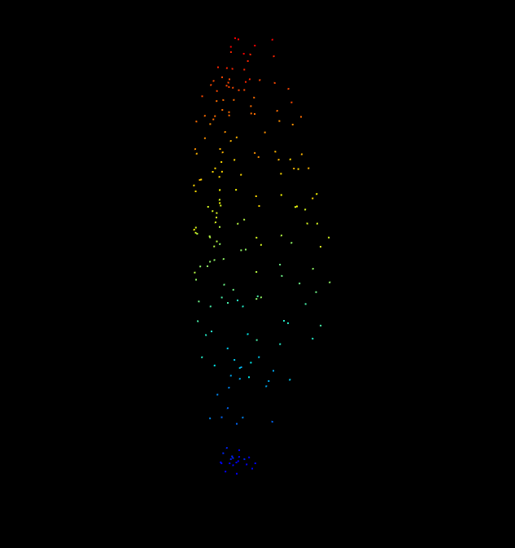
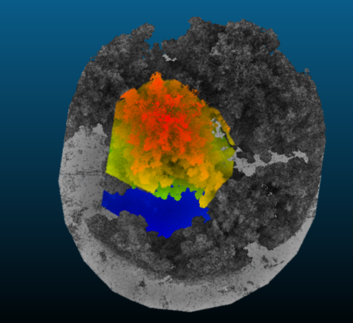

## Labeling tool for instance segmentation of individual trees in point-clouds using tree positions identified with 3DFin

### Background

The identification of individual trees from dense point clouds collected by TLS and MLS sensors has notable advanced recently with numerous ready-to-use solutions now being available for automatically identifying tree stems as well as DBH in multiple heights.

First models for assigning all points of a point cloud to tree individuals also exist but they are typically still showing some drawbacks and classification errors. Efficient labeling tools could potentially help in increasing the number of training data for these models and therefore contribute to further improvements.

Here, we present a simple labeling tool that bases on the idea of breaking down the 3D delineation of individuals trees in multiple 2D transect views of point clouds of individual trees. The script was written to make use of clipped point clouds around individual trees whose stems and positions have been identified using the software 3DFin. How to prepare these clipped point clouds is explained in Step 1. In Step 2, the labeling tool and its outputs are briefly explained. While the aim of the tutorial is the 2.5D delineation of the tree from the 3D point-cloud, the tool can be easily adjusted to provide for example crown length, height of the first branch or crown diameter.

### Step 1: Extracting individual tree point clouds based on 3DFin outputs

With the following code, a geopackage-file containing polygons representing the tree stem positions identified with 3DFin buffered with a round buffer of 7 m are loaded as well as the TLS point cloud containing all the trees contained in the geopackage-file.

The buffer of 7 m is relatively large in the given case and could be adjusted to match a size which ensures that the entire tree crown of the to be labeled/segmented trees as well as parts of its neighboring trees are included. In the example datasets, the trees are pines of intermediate size and have relatively small crowns.

The dataset for the script below is not provided since it is relatively large, but some exemplified extracted point clouds are provided for the second step. 
	
	# load required packages
	require(terra)
	require(sf)
	require(lidR)

	# set path to shapefile including tree stem positions + buffer
	setwd("E:/99_TLS_analyses/Rezina/Shapes")

	# Load your vector file (e.g., a shapefile with polygons)
	polygons <- st_read("3DFin_trees_overlapping_estevinos_1_convex_experiment_marked_buffer_7m_reproj.gpkg")

	# set path to point clouds
	setwd("E:/99_TLS_analyses/Rezina/")

	# --- Read point cloud as LAScatalog ---
	# If your data is a single LAS/LAZ file, you can still use readLAScatalog().
	# For multiple tiles, point it to the folder.
	ctg <- readLAScatalog("2024-08-06_rezina_transecto 0.010 m.las")

	# set folder to output path
	setwd("E:/99_TLS_analyses/Rezina/05_tree_pcs_7m")

	# Optional but recommended settings
	opt_chunk_size(ctg) <- 0            # Use 0 to avoid chunking (entire polygon is a chunk)
	opt_chunk_buffer(ctg) <- 0          # No buffer needed for clip_roi
	opt_filter(ctg) <- ""               # No filter applied by default
	opt_independent_files(ctg) <- TRUE  # Write results independently

	# Ensure CRS matches
	if (!st_crs(polygons) == st_crs(ctg)) {
	  polygons <- st_transform(polygons, st_crs(ctg))
	}

	# Optional: simplify polygons to reduce memory usage
	# polygons <- st_simplify(polygons, dTolerance = 1)  # Uncomment if needed

	# Loop through each polygon and clip ---
	for (i in 48:(nrow(polygons))) {
	  poly <- polygons[i, ]
	  
	  # Clip point cloud using the polygon
	  las_clip <- clip_roi(ctg, poly)
	  
	  # Skip empty results
	  if (is.empty(las_clip)) next
	  
	  # Create a unique filename (optionally use polygon ID)
	  out_file <- sprintf("pointcloud_poly_%03d.laz", i)
	  
	  # Save the clipped LAS
	  writeLAS(las_clip, out_file)
	  
	  # give current iteration
	  print(paste0("Saves file ", i, "of ", seq_len(nrow(polygons))))
	  
	}

### Step 2: Running the labeling tool and extracting all points belonging to the center tree using 2D-transect views

In this step, we will use some clipped point clouds from a terrestrial laserscanning dataset collected in Northern Spain. The dataset was collected with a Riegl VZ-400i scanner and covers an experimental resin production site.

The datasets can be downloaded here:

[Download extracted point clouds](https://drive.google.com/drive/folders/1vIm4fi1JS2YBZph3uhhQX7krBobOt9c3?usp=sharing)

Please download the datasets, unzip them if necessary, and put them into a folder on your hard disc. For example in the folder **D:/Tree_PCs**.

The entire script is available here:

Now we are ready to run the code for the labeling tool in R. First we load the packages:

	# load the required packages
	library(lidR)
	library(data.table)
	library(png)
	require(rgl)
	require(sp)

After this we define a function which will later on allow us to clip a slice from the point cloud based on a user-defined angle and slice-thickness. The input files from the first step are centered around the tree stem position of the trees identified by 3DFin. The slice function will produce slices of the point cloud which always include the stem position as well as 7 m left and right from the stem position (since we applied a buffer of 7 m in this case). The exact orientation of the slice is provided by a user-defined angle. Normally this function will not only be called once but several times, rotating around the tree until from the several 2D slices a 3D representation of the tree is created. This will become more clear in the next steps below.

	# Define the function to extract a slice from the point cloud
	# --- Slice Extraction ---
	extract_slice <- function(las, center, angle_deg, thickness = 0.5) {
	  angle_rad <- angle_deg * pi / 180
	  dir_x <- cos(angle_rad)
	  dir_y <- sin(angle_rad)
	  
	  dx <- las@data$X - center[1]
	  dy <- las@data$Y - center[2]
	  
	  proj_along <- dx * dir_x + dy * dir_y  # x'
	  proj_perp <- dx * (-dir_y) + dy * dir_x  # depth
	  
	  keep <- abs(proj_perp) <= (thickness / 2)
	  depth_vals <- proj_perp[keep]
	  depth_norm <- (depth_vals + thickness / 2) / thickness
	  
	  colors <- colorRampPalette(c("#f0f0f0", "#1f78b4"))(100)
	  color_idx <- pmin(pmax(round(depth_norm * 99) + 1, 1), 100)
	  
	  data.frame(
	    x_proj = proj_along[keep],
	    z = las@data$Z[keep],
	    X = las@data$X[keep],
	    Y = las@data$Y[keep],
	    Z = las@data$Z[keep],
	    col = colors[color_idx]
	  )
	}

As next step, we will load the data and set the parameters to run the labeling tool. As first step we define which file we want to load and label. For this we have to manually define a value for the variable **fnr**. In the example, we will define it as 1, meaning the first file in our folder. Once we have labeled this point-cloud, we can progress to the next file by changing fnr=1 to fnr=2

	# --- Parameters ---

	# select next tree (for each tree increase fnr by 1)
	fnr=1

Now, we load the paths to all filenames in the folder, extract the basename file of the current file (defined by fnr), load the point cloud and in the given case filter the point cloud to only remain 25% of the points to speed up the process (if you have sparser point clouds than we do in the current example, you might want to skip this step). We also check whether the file contains any files.

	# load paths to files in the folder containing the clipped point clouds
	path_to_file <- list.files("D:/Tree_PCs", pattern=".laz", full.names = T)
	# get basefile name for fnr th file
	filen <- basename(path_to_file[fnr])
	
	# load point cloud
	las1 <- readLAS(path_to_file[fnr])
	# filter point cloud to reduce the number of points to 25% of the original
	# number of point
	las <- filter_poi(las1, runif(npoints(las1)) < 0.25)

	# check whether las file contains data
	if (is.empty(las)) stop("LAS file is empty")

Next, we calculate some base metrics of the loaded point cloud that will need later on for slicing the point cloud and reprojecting the selected locations in the labeling process back to 3D coordinates.

	# calculate some base metrics
	# center of point clouds
	center <- c(mean(las@data$X), mean(las@data$Y))
	# determine/define minimum and maximum height
	zmin <- min(las@data$Z)
	zmax <- zmin + 30

	####
	#### these settings matter
	#### 
We also need to define the thickness of the point-cloud. Originally we used 0.5 m here but in some cases, it can be helpful to increase the slice a bit more, particularly if the tree is leaning and might otherwise not show in the point cloud. You can also adapt this value for each tree. Values larger than approximately 2 m should be avoided since then the accuracy of the labeling process starts to get affected.

	# define thickness of transect views
	slice_thickness <- 1.25

Another setting we can select is how many transects per view we want to work on. We do this by setting the step-size. For example a step size of 36° will lead to 10 transects. Be aware that some of these transects will be identical, just mirrored. So in theory you could also only create a sequence until 180°. However, the double labeling could also be considered as some sort of self-check and used later on (not yet implemented). 

	# define size of and steps of transects cuts through point cloud (in degree steps)
	# more angles means more slices to interpret per tree => will potentially be more accurate but also
	# more work 
	steps = 36
	angle <- seq(0,360-steps,steps)  # degrees

Now we are set to start the labeling - we first create an empty list to store the results and then run a for-loop which in each iteration will slice through the point cloud based on the defined angles and ask the user to label the current 2D-transect view (Figure 1).

	# create empty list to store resulting digitized coordinates
	coords_tree <- list()

	# loop through angles and label data

	for (i in 1:length(angle)){
	  
	  # --- Step 1: Create Slice and Save PNG ---
	  slice_df <- extract_slice(las, center, angle[i], slice_thickness)
	  xlim_range <- range(slice_df$x_proj)
	  ylim_range <- c(zmin, zmax)
	  
	  # define folder to save temporary images  
	  setwd("D:/Tree_PCs_hulls")
	  
	  png("slice_plot.png", width = 800, height = 1200)
	  # Margins area
	  #par(oma=c(0,0,0,0)) # all sides have 3 lines of space
	  #par(mar=c(0,0,0,0))
	  plot(slice_df$z ~ slice_df$x_proj,
	       col = slice_df$col, pch = 16, cex = 0.3,
	       xlab = "x'", ylab = "Z", xlim = xlim_range, ylim = ylim_range)
	  abline(v=0)
	  abline(v=5)
	  abline(v=-5)
	  
	  dev.off()
	  
	  # --- Step 2: Display PNG in Correct Coordinate System ---
	  img <- readPNG("slice_plot.png")
	  
	  plot(NA, xlim = xlim_range, ylim = ylim_range,
	       xlab = "x'", ylab = "Z", main = paste("Click crown points - Angle", angle[i]))
	  rasterImage(img, xlim_range[1], ylim_range[1], xlim_range[2], ylim_range[2])
	  
	  message("Click as many points as you want. ESC to stop.")
	  clicks <- locator(type = "p", col = "red", pch = 16)
	  
	  # --- Step 3: Convert Clicks to 3D Coordinates ---
	  if (!is.null(clicks)) {
	    angle_rad <- angle[i] * pi / 180
	    dir_x <- cos(angle_rad)
	    dir_y <- sin(angle_rad)
	    
	    x_proj_clicked <- clicks$x
	    z_clicked <- clicks$y
	    
	    coords_3D <- data.frame(
	      X = center[1] + x_proj_clicked * dir_x,
	      Y = center[2] + x_proj_clicked * dir_y,
	      Z = z_clicked
	    )
	    
	    print(coords_3D)
	    coords_tree[[i]] <- coords_3D
	    print(paste0("Completed ", i, "th transect view"))
	  }
	  
	  
	}

As shown in Figure 1, the labeling is quite straightforward. The user clicks into the graph to set points which enclose the silhouette of the tree. Once all points have been set, the user should press "**esc**"-button and the selected points will appear in the graph. Then the next slice will be obtained and the user again sets the points to define the silhouette. After the 2D-transects of all angles have been labeled, the loop stops and the user runs the next lines of code. The vertical lines shown in Figure 1 are meant to help with orientation and mark the center of the slice (where the tree stem is supposed to be) as well as parallel lines at 5 m distance to the left and right of the center line.

Here, the points set during each of the iterations will first be merged:

	# merge all coordinates to one file
	coords_fin <- do.call(rbind,coords_tree)
	head(coords_fin)

Then the dataframe containing the 3D-coordinates of all points set by the user are converted into a las-file and plotted and saved.

	# convert to las file
	hull <- LAS(coords_fin)

	# plot las f ile
	plot(hull)
	
	# save hull fil
	writeLAS(hull, paste0("hull_" , filen))

This will result in a view as shown in Figure 2 and 3. In the top view of this small point cloud, you can clearly see the transects that have been labeled by the user (Figure 3).

As next step, a 2D convex hull will be created (basically a polygon including all point when seen from a top view) and saved as a Spatial Polygon file

	# create 2D convex hull
	hull_coords <- hull@data[, c("X", "Y")]
	hull_indices <- chull(hull_coords)
	hull_coords2 <- hull_coords[c(hull_indices, hull_indices[1]), ]  # Close the polygon

	# Create a SpatialPolygons object from the convex hull
	hull_polygon <- SpatialPolygons(list(Polygons(list(Polygon(hull_coords2)), ID = "1")))
	#hull_polygon2 <- gBuffer(hull_polygon, width = 0.1)

As last step, the original point cloud will be clipped with the convex full shapefile and with this step, the tree which has been marked with the silhouettes by the user will be saved to an own laz-file. 

	# Clip the first point cloud using the convex hull polygon
	proj4string(hull_polygon) <- crs(las)

	clipped <- clip_roi(las1, hull_polygon)

	# write to file
	writeLAS(clipped, paste0("extr_tree_", filen))

This laz-file can then be visualized for example in cloud-compare and displayed along with the original point cloud from which it was extracted. In some cases, some additional fine-tuning could be conducted to make sure that the point clouds is really complete and at the same time does not contain any points belonging to another tree. Given that the clipping of the original point cloud is currently only conducted using a 2D convex hull, the results are not optimal.

As shown in Figure 4, the tree model looks quite plausible, but there are also clearly some parts where the point cloud was not cut perfectly (Figure 5). 

### Points to be improved + next steps:

The following points could be improved:
- Clip point using 3D convex hull instead of 2D convex hull
- Save meta data (number of angles, number of points digitized per angle, etc.), potentially also along with each labeled point
- ...

Next steps:
- Create an option to create 2D-labels for each transect view that will allow to train a CNN to automatically detect tree silhouettes from transect views
- ...
